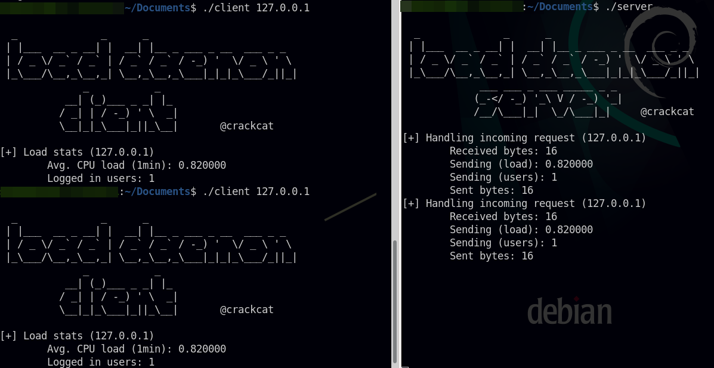

# A UDP Client Server Demo in C (Example: load daemon)

This code was developed to demonstrate a connectionless communication between a client and a server to exchange information using C sockets and structs. The example mimicks a server that takes UDP requests from any client and reports back to them with a structure that is filled with information about the current load status of the server, namely the average CPU load and the amount of currently logged in users.

> **Disclaimer**: By default the server will expose the port 4701 on *all* interfaces. This application is not suited for deployment or production purposes, it's just an example.

## Usage example

After compiling the client and server code, we can start the server (which will run until we kill it) and subsequently execute some client requests. The applications are not meant to do anything more but are rather an example for sending data in C `struct`s via UDP between a server and a client.

### `client_loadd.c`

This is the UDP client. Compile instructions can be found in the comments but a simple `gcc -o client client_loadd.c` will do.

### `server_loadd.c`

This is the UDP server. Compile instructions can be found in the comments but a simple `gcc -o server server_loadd.c` will do.
